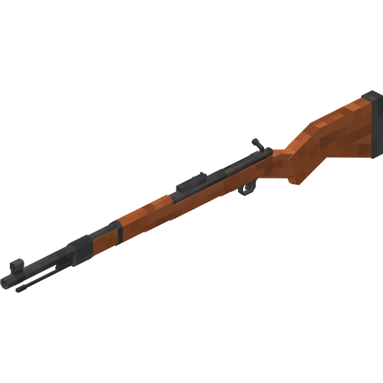

# Kar_98k
**Mauser 98k model that replaces the crossbow**

Model of the Mauser 98k carbine, which will replace the crossbow after being renamed kar98k\
\
The Vanilla version replaces the crossbow texture with the Mauser 98k carbine texture.\
For the Optifine version, you need to rename the crossbow to *kar98k*. Works on any version of Minecraft, but requires Optifine or CIT Resewn.
___
*You can add anything else, the main requirement is that the name contains the kar98k part.

[P.S. translated by DeepL]
